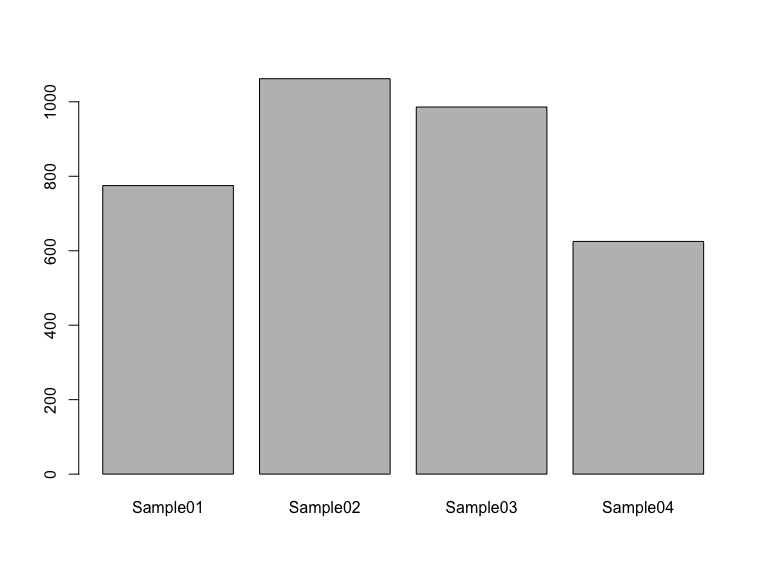
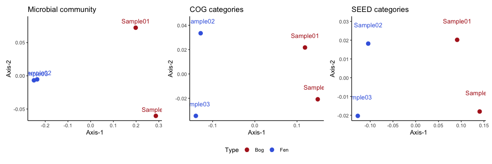

Read based analysis in R
================
Igor Pessi & Antti Karkman

-   [Packages and metadata](#packages-and-metadata)
-   [METAXA2](#metaxa2)
    -   [Data import](#data-import)
    -   [Data exploration](#data-exploration)
    -   [Alpha diversity](#alpha-diversity)
    -   [Beta diversity](#beta-diversity)
    -   [Differential abundance
        analysis](#differential-abundance-analysis)
-   [MEGAN](#megan)
    -   [Data import](#data-import-1)
    -   [Data exploration](#data-exploration-1)
    -   [Alpha diversity](#alpha-diversity-1)
    -   [Beta diversity](#beta-diversity-1)
    -   [Differential abundance
        analysis](#differential-abundance-analysis-1)
        -   [Microbial community](#microbial-community)
        -   [COG categories](#cog-categories)
        -   [SEED categories](#seed-categories)

## Packages and metadata

We need few external packages for the analyses. These include:

-   `tidyverse` for data wrangling (includes `ggplot2` for plotting)
-   `phyloseq` for easy storage and manipulation of ’omics data
-   `vegan` for diversity analyses
-   `DESeq2` for differential abundance analysis
-   `patchwork` for plot layouts

``` r
library(tidyverse)
library(phyloseq)
library(vegan)
library(DESeq2)
library(patchwork)
metadata <- read.table("Data/metadata.txt", sep="\t", row.names=1, header=TRUE)
```

## METAXA2

### Data import

``` r
metaxa6 <- read.table("Data/metaxa_genus.txt", sep="\t", header=TRUE, row.names=1)
TAX <- data.frame(Taxa=row.names(metaxa6))
TAX <- TAX %>% separate(Taxa, into=c("Kingdom", "Phylum", "Class", "Order", "Family", "Genus"), sep=";")

row.names(metaxa6) <- paste0("OTU", seq(nrow(metaxa6)))
row.names(TAX) <- paste0("OTU", seq(nrow(TAX)))

OTU <- otu_table(metaxa6, taxa_are_rows=TRUE)
metaxa_genus <- phyloseq(OTU, tax_table(as.matrix(TAX)), sample_data(metadata))
```

### Data exploration

``` r
metaxa_genus
```

    ## phyloseq-class experiment-level object
    ## otu_table()   OTU Table:         [ 427 taxa and 4 samples ]
    ## sample_data() Sample Data:       [ 4 samples by 1 sample variables ]
    ## tax_table()   Taxonomy Table:    [ 427 taxa by 6 taxonomic ranks ]

``` r
head(otu_table(metaxa_genus))
```

    ## OTU Table:          [6 taxa and 4 samples]
    ##                      taxa are rows
    ##      Sample01 Sample02 Sample03 Sample04
    ## OTU1        0        1        0        0
    ## OTU2        0        4        6        0
    ## OTU3        0        1        1        0
    ## OTU4        0        0        1        0
    ## OTU5        0        0        1        0
    ## OTU6        0        0        1        0

``` r
head(tax_table(metaxa_genus))
```

    ## Taxonomy Table:     [6 taxa by 6 taxonomic ranks]:
    ##      Kingdom   Phylum          Class             Order               
    ## OTU1 "Archaea" "Crenarchaeota" "Thermoprotei"    "Acidilobales"      
    ## OTU2 "Archaea" "Euryarchaeota" "Methanobacteria" "Methanobacteriales"
    ## OTU3 "Archaea" "Euryarchaeota" "Methanobacteria" "Methanobacteriales"
    ## OTU4 "Archaea" "Euryarchaeota" "Methanobacteria" "Methanobacteriales"
    ## OTU5 "Archaea" "Euryarchaeota" "Methanococci"    "Methanococcales"   
    ## OTU6 "Archaea" "Euryarchaeota" "Methanomicrobia" "Methanomicrobiales"
    ##      Family                            Genus                             
    ## OTU1 "Caldisphaeraceae"                "Caldisphaera"                    
    ## OTU2 "Methanobacteriaceae"             "Methanobacterium"                
    ## OTU3 "Methanobacteriaceae"             "Unclassified Methanobacteriaceae"
    ## OTU4 "Unclassified Methanobacteriales" ""                                
    ## OTU5 "Unclassified Methanococcales"    ""                                
    ## OTU6 "Family Incertae Sedis"           "Methanocalculus"

``` r
sample_data(metaxa_genus)
```

    ##          Type
    ## Sample01  Bog
    ## Sample02  Fen
    ## Sample03  Fen
    ## Sample04  Bog

``` r
sample_sums(metaxa_genus)
```

    ## Sample01 Sample02 Sample03 Sample04 
    ##      775     1062      986      625

``` r
barplot(sample_sums(metaxa_genus))
```

<!-- -->

``` r
taxa_sums(metaxa_genus) %>% sort(decreasing=TRUE) %>% head(10)
```

    ## OTU375 OTU423  OTU87 OTU425  OTU27 OTU150  OTU32  OTU98  OTU95 OTU136 
    ##    762    102     91     89     86     86     78     77     72     69

``` r
tax_table(metaxa_genus)["OTU27",]
```

    ## Taxonomy Table:     [1 taxa by 6 taxonomic ranks]:
    ##       Kingdom    Phylum          Class           Order             
    ## OTU27 "Bacteria" "Acidobacteria" "Acidobacteria" "Acidobacteriales"
    ##       Family              Genus                           
    ## OTU27 "Acidobacteriaceae" "Unclassified Acidobacteriaceae"

``` r
abund_taxa <- taxa_sums(metaxa_genus) %>% sort(decreasing=TRUE) %>% head(10) %>% names()
tax_table(metaxa_genus)[abund_taxa,]
```

    ## Taxonomy Table:     [10 taxa by 6 taxonomic ranks]:
    ##        Kingdom        Phylum                      Class                        
    ## OTU375 "Bacteria"     "Unclassified Bacteria"     ""                           
    ## OTU423 "Eukaryota"    "Viridiplantae"             "Streptophyta"               
    ## OTU87  "Bacteria"     "Actinobacteria"            "Actinobacteria"             
    ## OTU425 "Mitochondria" "Unclassified Mitochondria" ""                           
    ## OTU27  "Bacteria"     "Acidobacteria"             "Acidobacteria"              
    ## OTU150 "Bacteria"     "Chloroflexi"               "Anaerolineae"               
    ## OTU32  "Bacteria"     "Acidobacteria"             "Acidobacteria"              
    ## OTU98  "Bacteria"     "Actinobacteria"            "Unclassified Actinobacteria"
    ## OTU95  "Bacteria"     "Actinobacteria"            "Thermoleophilia"            
    ## OTU136 "Bacteria"     "Bacteroidetes"             "Unclassified Bacteroidetes" 
    ##        Order                         Family                            
    ## OTU375 ""                            ""                                
    ## OTU423 "Embryophyta"                 "Unclassified Embryophyta"        
    ## OTU87  "Unclassified Actinobacteria" ""                                
    ## OTU425 ""                            ""                                
    ## OTU27  "Acidobacteriales"            "Acidobacteriaceae"               
    ## OTU150 "Anaerolineales"              "Anaerolineaceae"                 
    ## OTU32  "Unclassified Acidobacteria"  ""                                
    ## OTU98  ""                            ""                                
    ## OTU95  "Solirubrobacterales"         "Unclassified Solirubrobacterales"
    ## OTU136 ""                            ""                                
    ##        Genus                           
    ## OTU375 ""                              
    ## OTU423 ""                              
    ## OTU87  ""                              
    ## OTU425 ""                              
    ## OTU27  "Unclassified Acidobacteriaceae"
    ## OTU150 "Unclassified Anaerolineaceae"  
    ## OTU32  ""                              
    ## OTU98  ""                              
    ## OTU95  ""                              
    ## OTU136 ""

### Alpha diversity

``` r
shannon <- diversity(t(otu_table(metaxa_genus)), index="shannon")
barplot(shannon, ylab="Shannon diversity")
```

<!-- -->

``` r
observed <- specnumber(t(otu_table(metaxa_genus)))
barplot(observed, ylab="Observed taxa")
```

<!-- -->

### Beta diversity

``` r
dist_mat <- vegdist(t(otu_table(metaxa_genus)))
ord <- cmdscale(dist_mat)
df <- data.frame(ord, Type=sample_data(metaxa_genus)$Type)

ggplot(df, aes(x=X1, y=X2, color=Type)) +
  geom_point(size=3) + 
  scale_color_manual(values=c("firebrick", "royalblue")) +
  theme_classic() + labs(x="Axis-1", y="Axis-2") + 
  geom_text(label=row.names(df), nudge_y=0.03) + theme(legend.position="bottom")
```

<!-- -->

### Differential abundance analysis

``` r
tmp <- subset_taxa(metaxa_genus, Kingdom!="Eukaryota")
deseq_genus = phyloseq_to_deseq2(tmp, ~ Type)
deseq_genus = DESeq(deseq_genus, test="Wald", fitType="local")

res = results(deseq_genus, cooksCutoff = FALSE)
alpha = 0.01
res_table = res[which(res$padj < alpha), ]
res_table = cbind(as(res_table, "data.frame"), as(tax_table(tmp)[rownames(res_table), ], "matrix"))

res_table[order(res_table$log2FoldChange),] %>%
    knitr::kable(digits=2)
```

|        | baseMean | log2FoldChange | lfcSE |  stat | pvalue | padj | Kingdom      | Phylum                    | Class                      | Order                            | Family                   | Genus                        |
|:-------|---------:|---------------:|------:|------:|-------:|-----:|:-------------|:--------------------------|:---------------------------|:---------------------------------|:-------------------------|:-----------------------------|
| OTU425 |    21.57 |          -6.40 |  1.55 | -4.12 |      0 | 0.00 | Mitochondria | Unclassified Mitochondria |                            |                                  |                          |                              |
| OTU159 |     5.19 |          -5.82 |  1.89 | -3.08 |      0 | 0.01 | Bacteria     | Chloroflexi               | Ktedonobacteria            | Ktedonobacterales                | Ktedonobacteraceae       | Ktedonobacter                |
| OTU266 |    10.03 |          -4.25 |  1.17 | -3.63 |      0 | 0.00 | Bacteria     | Proteobacteria            | Alphaproteobacteria        | Rhizobiales                      | Unclassified Rhizobiales |                              |
| OTU375 |   188.15 |           2.99 |  0.23 | 13.11 |      0 | 0.00 | Bacteria     | Unclassified Bacteria     |                            |                                  |                          |                              |
| OTU342 |    15.63 |           3.38 |  0.75 |  4.48 |      0 | 0.00 | Bacteria     | Proteobacteria            | Deltaproteobacteria        | Unclassified Deltaproteobacteria |                          |                              |
| OTU166 |     8.67 |           4.19 |  1.23 |  3.41 |      0 | 0.00 | Bacteria     | Chloroflexi               | Unclassified Chloroflexi   |                                  |                          |                              |
| OTU136 |    17.13 |           4.60 |  0.96 |  4.78 |      0 | 0.00 | Bacteria     | Bacteroidetes             | Unclassified Bacteroidetes |                                  |                          |                              |
| OTU337 |     7.75 |           5.03 |  1.61 |  3.12 |      0 | 0.01 | Bacteria     | Proteobacteria            | Deltaproteobacteria        | Syntrophobacterales              | Syntrophaceae            | Unclassified Syntrophaceae   |
| OTU13  |     6.25 |           6.21 |  1.76 |  3.54 |      0 | 0.00 | Archaea      | Euryarchaeota             | Methanomicrobia            | Methanosarcinales                | Methanosaetaceae         | Methanosaeta                 |
| OTU11  |     7.00 |           6.38 |  1.67 |  3.81 |      0 | 0.00 | Archaea      | Euryarchaeota             | Methanomicrobia            | Methanomicrobiales               | Rice Cluster II          | Methanosarcina               |
| OTU150 |    21.46 |           6.54 |  1.48 |  4.43 |      0 | 0.00 | Bacteria     | Chloroflexi               | Anaerolineae               | Anaerolineales                   | Anaerolineaceae          | Unclassified Anaerolineaceae |

## MEGAN

### Data import

``` r
megan_genus <- import_biom("Data/MEGAN_genus.biom")
sample_data(megan_genus) <- sample_data(metadata)

megan_COG <- import_biom("Data/MEGAN_EGGNOG.biom")
sample_data(megan_COG) <- sample_data(metadata)
megan_SEED <- import_biom("Data/MEGAN_SEED.biom")
sample_data(megan_SEED) <- sample_data(metadata)
```

### Data exploration

``` r
# Do it yourself
```

### Alpha diversity

``` r
shannon <- diversity(t(otu_table(megan_genus)), index="shannon")
barplot(shannon, ylab="Shannon diversity")
```

<!-- -->

``` r
shannon <- diversity(t(otu_table(megan_COG)), index="shannon")
barplot(shannon, ylab="Shannon diversity")
```

<!-- -->

``` r
shannon <- diversity(t(otu_table(megan_SEED)), index="shannon")
barplot(shannon, ylab="Shannon diversity")
```

<!-- -->

### Beta diversity

``` r
dist_mat <- vegdist(t(otu_table(megan_genus)))
ord <- cmdscale(dist_mat)
df <- data.frame(ord, Type=sample_data(megan_genus)$Type)

p1 <- ggplot(df, aes(x=X1, y=X2, color=Type)) +
  geom_point(size=3) + 
  scale_color_manual(values=c("firebrick", "royalblue")) +
  theme_classic() + labs(title="Microbial community", x="Axis-1", y="Axis-2") + 
  geom_text(label=row.names(df), nudge_y=0.01) + theme(legend.position="bottom")

dist_mat <- vegdist(t(otu_table(megan_COG)))
ord <- cmdscale(dist_mat)
df <- data.frame(ord, Type=sample_data(megan_COG)$Type)

p2 <- ggplot(df, aes(x=X1, y=X2, color=Type)) +
  geom_point(size=3) + 
  scale_color_manual(values=c("firebrick", "royalblue")) +
  theme_classic() + labs(title="COG categories", x="Axis-1", y="Axis-2") + 
  geom_text(label=row.names(df), nudge_y=0.01) + theme(legend.position="bottom")

dist_mat <- vegdist(t(otu_table(megan_SEED)))
ord <- cmdscale(dist_mat)
df <- data.frame(ord, Type=sample_data(megan_SEED)$Type)

p3 <- ggplot(df, aes(x=X1, y=X2, color=Type)) +
  geom_point(size=3) + 
  scale_color_manual(values=c("firebrick", "royalblue")) +
  theme_classic() + labs(title="SEED categories", x="Axis-1", y="Axis-2") + 
  geom_text(label=row.names(df), nudge_y=0.01) + theme(legend.position="bottom")

p1 + p2 + p3 + 
  plot_layout(guides = 'collect') & theme(legend.position='bottom')
```

<!-- -->

### Differential abundance analysis

#### Microbial community

``` r
tmp <- subset_taxa(megan_genus, Rank1!="d__Eukaryota")
deseq_genus = phyloseq_to_deseq2(tmp, ~ Type)
deseq_genus = DESeq(deseq_genus, test="Wald", fitType="local")

res = results(deseq_genus, cooksCutoff = FALSE)
alpha = 0.01
res_table = res[which(res$padj < alpha), ]
res_table = cbind(as(res_table, "data.frame"), as(tax_table(megan_genus)[rownames(res_table), ], "matrix"))
```

**More abundant taxa in Bog**

``` r
res_table[order(res_table$log2FoldChange),]  %>% 
  filter(log2FoldChange<0) %>%
  head(5) %>%  
  janitor::clean_names() %>%
  knitr::kable(digits=2)
```

|         | base\_mean | log2fold\_change | lfc\_se |  stat | pvalue | padj | rank1         | rank2               | rank3                    | rank4                    | rank5                    | rank6             | rank7 |
|:--------|-----------:|-----------------:|--------:|------:|-------:|-----:|:--------------|:--------------------|:-------------------------|:-------------------------|:-------------------------|:------------------|:------|
| 445219  |    1077.86 |           -26.32 |    4.78 | -5.50 |      0 |    0 | d\_\_Bacteria | p\_\_Proteobacteria | c\_\_Alphaproteobacteria | o\_\_Rhodospirillales    | g\_\_Reyranella          | NA                | NA    |
| 1643958 |     579.52 |           -25.60 |    4.78 | -5.35 |      0 |    0 | d\_\_Bacteria | p\_\_Proteobacteria | c\_\_Alphaproteobacteria | o\_\_Rhizobiales         | f\_\_Roseiarcaceae       | g\_\_Roseiarcus   | NA    |
| 1988    |     310.87 |           -24.75 |    4.78 | -5.17 |      0 |    0 | d\_\_Bacteria | p\_\_Actinobacteria | c\_\_Actinobacteria      | o\_\_Streptosporangiales | f\_\_Thermomonosporaceae | g\_\_Actinomadura | NA    |
| 29407   |     298.23 |           -24.68 |    4.78 | -5.16 |      0 |    0 | d\_\_Bacteria | p\_\_Proteobacteria | c\_\_Alphaproteobacteria | o\_\_Rhizobiales         | f\_\_Hyphomicrobiaceae   | g\_\_Rhodoplanes  | NA    |
| 85025   |     283.13 |           -24.61 |    4.78 | -5.14 |      0 |    0 | d\_\_Bacteria | p\_\_Actinobacteria | c\_\_Actinobacteria      | o\_\_Corynebacteriales   | f\_\_Nocardiaceae        | NA                | NA    |

**More abundant taxa in Fen**

``` r
res_table[order(res_table$log2FoldChange),]  %>% 
  filter(log2FoldChange>0) %>%
  tail(5) %>%  
  janitor::clean_names() %>%
  knitr::kable(digits=2)
```

|         | base\_mean | log2fold\_change | lfc\_se | stat | pvalue | padj | rank1         | rank2               | rank3                    | rank4                    | rank5                      | rank6                 | rank7 |
|:--------|-----------:|-----------------:|--------:|-----:|-------:|-----:|:--------------|:--------------------|:-------------------------|:-------------------------|:---------------------------|:----------------------|:------|
| 135618  |     463.07 |            25.32 |    4.78 | 5.29 |      0 |    0 | d\_\_Bacteria | p\_\_Proteobacteria | c\_\_Gammaproteobacteria | o\_\_Methylococcales     | NA                         | NA                    | NA    |
| 1198451 |     584.80 |            25.64 |    4.78 | 5.36 |      0 |    0 | d\_\_Archaea  | p\_\_Euryarchaeota  | c\_\_Methanomicrobia     | o\_\_Methanomicrobiales  | f\_\_Methanoregulaceae     | NA                    | NA    |
| 161492  |     637.30 |            25.76 |    4.78 | 5.38 |      0 |    0 | d\_\_Bacteria | p\_\_Proteobacteria | c\_\_Deltaproteobacteria | o\_\_Myxococcales        | f\_\_Anaeromyxobacteraceae | g\_\_Anaeromyxobacter | NA    |
| 2357    |     682.60 |            25.86 |    4.78 | 5.40 |      0 |    0 | d\_\_Bacteria | p\_\_Proteobacteria | c\_\_Deltaproteobacteria | o\_\_Syntrophobacterales | f\_\_Syntrophaceae         | g\_\_Desulfomonile    | NA    |
| 2222    |     736.65 |            25.96 |    4.78 | 5.43 |      0 |    0 | d\_\_Archaea  | p\_\_Euryarchaeota  | c\_\_Methanomicrobia     | o\_\_Methanosarcinales   | f\_\_Methanotrichaceae     | g\_\_Methanothrix     | NA    |

#### COG categories

``` r
deseq_COG = phyloseq_to_deseq2(megan_COG, ~ Type)
deseq_COG = DESeq(deseq_COG, test="Wald", fitType="local")

res = results(deseq_COG, cooksCutoff = FALSE)
alpha = 0.01
res_table = res[which(res$padj < alpha), ]
res_table = cbind(as(res_table, "data.frame"), as(tax_table(megan_COG)[rownames(res_table), ], "matrix"))
```

**More abundant COG categories in Bog**

``` r
res_table[order(res_table$log2FoldChange),]  %>% 
  filter(log2FoldChange<0) %>%
  head(5) %>%  
  janitor::clean_names() %>%
  knitr::kable(digits=2)
```

|      | base\_mean | log2fold\_change | lfc\_se |  stat | pvalue | padj | rank1 | rank2                         | rank3                                                               | rank4                                                                                                                              |
|:-----|-----------:|-----------------:|--------:|------:|-------:|-----:|:------|:------------------------------|:--------------------------------------------------------------------|:-----------------------------------------------------------------------------------------------------------------------------------|
| 5042 |      18.56 |            -7.50 |    1.55 | -4.84 |      0 |    0 | Root  | metabolism                    | \[F\] Nucleotide transport and metabolism                           | COG5042 Purine nucleoside permease                                                                                                 |
| 3546 |      12.62 |            -6.95 |    1.58 | -4.40 |      0 |    0 | Root  | metabolism                    | \[P\] Inorganic ion transport and metabolism                        | COG3546 Catalase                                                                                                                   |
| 3486 |       7.99 |            -6.28 |    1.68 | -3.74 |      0 |    0 | Root  | metabolism                    | \[Q\] Secondary metabolites biosynthesis, transport and catabolism  | COG3486 L-lysine 6-monooxygenase (NADPH)                                                                                           |
| 3709 |       7.09 |            -6.11 |    1.67 | -3.66 |      0 |    0 | Root  | metabolism                    | \[P\] Inorganic ion transport and metabolism                        | COG3709 Catalyzes the phosphorylation of ribose 1,5-bisphosphate to 5-phospho-D-ribosyl alpha-1-diphosphate (PRPP) (By similarity) |
| 4959 |       7.07 |            -6.11 |    1.68 | -3.65 |      0 |    0 | Root  | cellularProcessesAndSignaling | \[U\] Intracellular trafficking, secretion, and vesicular transport | COG4959 Conjugal transfer protein                                                                                                  |

**More abundant COG categories in Fen**

``` r
res_table[order(res_table$log2FoldChange),]  %>% 
  filter(log2FoldChange>0) %>%
  tail(5) %>%  
  janitor::clean_names() %>%
  knitr::kable(digits=2)
```

|      | base\_mean | log2fold\_change | lfc\_se | stat | pvalue | padj | rank1 | rank2      | rank3                                     | rank4                                                                                                                                  |
|:-----|-----------:|-----------------:|--------:|-----:|-------:|-----:|:------|:-----------|:------------------------------------------|:---------------------------------------------------------------------------------------------------------------------------------------|
| 4624 |      82.35 |             8.54 |    1.47 | 5.82 |      0 |    0 | Root  | metabolism | \[C\] Energy production and conversion    | COG4624 metallo-sulfur cluster assembly                                                                                                |
| 67   |      31.22 |             8.58 |    1.51 | 5.69 |      0 |    0 | Root  | metabolism | \[E\] Amino acid transport and metabolism | COG0067 glutamate synthase                                                                                                             |
| 1614 |      36.51 |             8.81 |    1.50 | 5.88 |      0 |    0 | Root  | metabolism | \[C\] Energy production and conversion    | COG1614 Part of a complex that catalyzes the reversible cleavage of acetyl-CoA, allowing autotrophic growth from CO(2) (By similarity) |
| 1456 |      42.06 |             9.01 |    1.49 | 6.04 |      0 |    0 | Root  | metabolism | \[C\] Energy production and conversion    | COG1456 Acetyl-CoA decarbonylase synthase complex subunit gamma                                                                        |
| 1908 |     112.66 |            10.43 |    1.46 | 7.12 |      0 |    0 | Root  | metabolism | \[C\] Energy production and conversion    | COG1908 Methyl-viologen-reducing hydrogenase, delta subunit                                                                            |

#### SEED categories

``` r
deseq_SEED = phyloseq_to_deseq2(megan_SEED, ~ Type)
deseq_SEED = DESeq(deseq_SEED, test="Wald", fitType="local")

res = results(deseq_SEED, cooksCutoff = FALSE)
alpha = 0.01
res_table = res[which(res$padj < alpha), ]
res_table = cbind(as(res_table, "data.frame"), as(tax_table(megan_SEED)[rownames(res_table), ], "matrix"))
```

**More abundant SEED categories in Bog**

``` r
res_table[order(res_table$log2FoldChange),]  %>% 
  filter(log2FoldChange<0) %>%
  head(5) %>%  
  janitor::clean_names() %>%
  knitr::kable(digits=2)
```

|       | base\_mean | log2fold\_change | lfc\_se |  stat | pvalue | padj | rank1 | rank2                               | rank3                                  | rank4                                                          | rank5                                 |
|:------|-----------:|-----------------:|--------:|------:|-------:|-----:|:------|:------------------------------------|:---------------------------------------|:---------------------------------------------------------------|:--------------------------------------|
| 23068 |      35.35 |            -6.21 |    1.20 | -5.18 |      0 | 0.00 | Root  | Stress Response, Defense, Virulence | Stress Response, Defense and Virulence | Resistance to antibiotics and toxic compounds                  | Fusaric acid resistance cluster       |
| 23294 |       5.82 |            -6.07 |    2.10 | -2.88 |      0 | 0.01 | Root  | Metabolism                          | Cofactors, Vitamins, Prosthetic Groups | Tetrapyrroles                                                  | Mycobacterial heme acquisition system |
| 11305 |      45.15 |            -5.98 |    1.00 | -5.97 |      0 | 0.00 | Root  | DNA Processing                      | DNA replication                        | Plasmid replication                                            | NA                                    |
| 23192 |       5.23 |            -5.92 |    2.06 | -2.87 |      0 | 0.01 | Root  | Membrane Transport                  | Protein secretion system, Type VII     | ESAT-6 protein secretion system in Mycobacteria (locus ESX-5)  | NA                                    |
| 23407 |       5.15 |            -5.89 |    1.96 | -3.01 |      0 | 0.01 | Root  | Membrane Transport                  | Protein secretion system, Type VII     | ESAT-6 proteins secretion system in Mycobacteria (locus ESX-3) | NA                                    |

**More abundant SEED categories in Fen**

``` r
res_table[order(res_table$log2FoldChange),]  %>% 
  filter(log2FoldChange>0) %>%
  tail(5) %>%  
  janitor::clean_names() %>%
  knitr::kable(digits=2)
```

|       | base\_mean | log2fold\_change | lfc\_se | stat | pvalue | padj | rank1 | rank2              | rank3             | rank4                                | rank5                                      |
|:------|-----------:|-----------------:|--------:|-----:|-------:|-----:|:------|:-------------------|:------------------|:-------------------------------------|:-------------------------------------------|
| 23452 |     118.16 |             8.80 |    1.47 | 5.99 |      0 |    0 | Root  | Energy             | Respiration       | Anaerobic respiratory complex QmoABC | NA                                         |
| 23454 |      44.64 |             8.84 |    1.54 | 5.74 |      0 |    0 | Root  | Energy             | Respiration       | Electron donating reactions          | Energy-conserving hydrogenase (ferredoxin) |
| 23473 |      45.09 |             8.85 |    1.54 | 5.75 |      0 |    0 | Root  | Protein Processing | Protein Synthesis | Aminoacyl-tRNA-synthetases           | tRNA aminoacylation, Pyr                   |
| 14589 |     405.48 |             9.58 |    1.03 | 9.25 |      0 |    0 | Root  | Energy             | Respiration       | Hydrogenases                         | Carbon monoxide induced hydrogenase        |
| 23356 |     158.08 |            10.66 |    1.47 | 7.23 |      0 |    0 | Root  | Metabolism         | Carbohydrates     | CO2 fixation                         | Acetyl-CoA Pathway Wood-Ljungdahl          |
